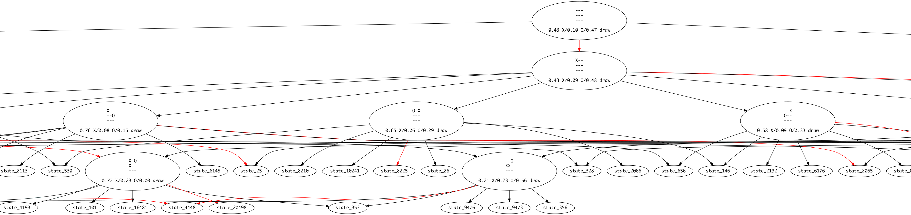

# Tictactoe Analysis

This is a simple analysis of the game of [tic-tac-toe](https://en.wikipedia.org/wiki/Tic-tac-toe). Although tic-tac-toe is an extremely limited game in terms of depth (up to 9 moves) and breadth (up to $9 - \text{depth}$ without optimizations), it is an interesting space to explore and learn a language in. By minimizing the "board state" to its simplest form, we can greatly reduce the branching factor of the game from about 250,000 different states to only around 3,194. This isn't optimizing out mirrored states, but it is good nonetheless.

I chose to use Go since it is fast and also since I wanted to represent the board state in a single 32-bit unsigned integer. This allows for fast hashing of the board to test if it is identical to another board state. This is done by rotating the board four times and remembering the minimum integer value of the board.

The board is used to build a decision tree, and that tree can then be used with various path finding algorithms to find the optimal move, such as [MiniMax](https://en.wikipedia.org/wiki/Minimax).

The resulting tree is exported to a .dot file and can be converted to a PDF/PNG/file of your choice via [GraphViz's `dot` program](https://graphviz.org/).

## Room for improvement

I am not good at Go, so the code could be cleaned up a bit.

My function to rotate a board clockwise or counterclockwise is dumb (manually swaps all eight values around the center of the board) but works for a 3x3 board.

I need to make it so that you can actually play against the decision tree.

I want a way to export the decision tree so you can play against it.
